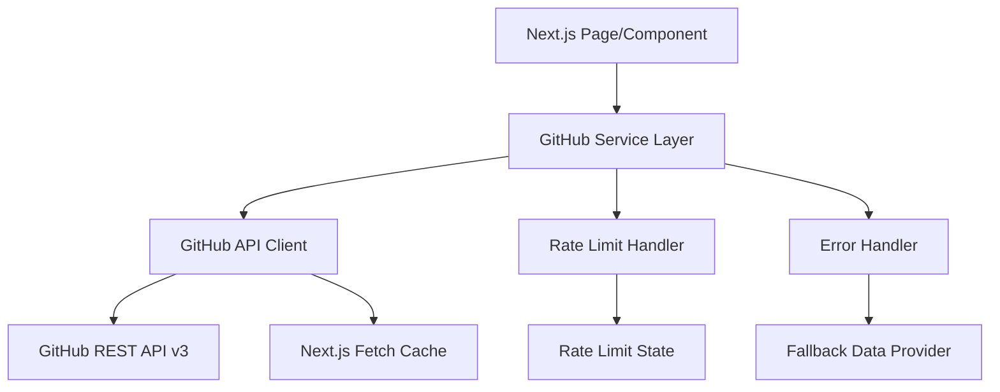

# Design Document: GitHub Integration

## Overview

This design implements a GitHub API integration for the Next.js portfolio website to replace mock data with real repository information. The solution follows a layered architecture with clear separation between API communication, caching, error handling, and presentation layers.

The integration fetches repository data from GitHub's REST API v3, implements intelligent caching to minimize API calls, handles rate limiting gracefully, and maintains type safety throughout the application. The design prioritizes reliability, performance, and maintainability while supporting the existing internationalization features.

### Key Design Decisions

1. **Server-Side Data Fetching**: Use Next.js Server Components and Server Actions to fetch GitHub data server-side, keeping API tokens secure and reducing client-side JavaScript
2. **Next.js Native Caching**: Leverage Next.js 14's built-in fetch caching and revalidation system to automatically cache repository data and reduce API calls
3. **Graceful Degradation**: Fall back to mock data when API limits are reached or errors occur
4. **Incremental Adoption**: Design allows gradual migration from mock data to real GitHub data without breaking existing functionality

## Architecture

### System Components



### Data Flow

1. **Initial Request**: Page component requests GitHub data from service layer
2. **Next.js Cache Check**: Next.js automatically checks if cached fetch response exists and is valid
3. **API Request**: If cache miss or revalidation needed, make authenticated request to GitHub API
4. **Rate Limit Check**: Before API call, verify rate limit quota is available
5. **Response Processing**: Transform GitHub API response to application types
6. **Automatic Caching**: Next.js automatically caches successful fetch responses
7. **Error Handling**: On failure, return fallback to mock data
8. **Presentation**: Component receives typed data and renders

### Technology Stack

- **HTTP Client**: Native `fetch` API with Next.js caching (built into Node.js 18+)
- **Caching**: Next.js 14 built-in fetch cache with revalidation
- **Type Safety**: TypeScript with strict mode enabled
- **Testing**: Jest for unit tests, fast-check for property-based tests
- **API**: GitHub REST API v3

## Components and Interfaces

### 1. GitHub API Client (`lib/github/client.ts`)

Responsible for making authenticated HTTP requests to GitHub API with Next.js caching.

```typescript
interface GitHubClientConfig {
  token?: string;
  username: string;
  baseUrl?: string;
  revalidate?: number; // Next.js revalidation time in seconds
}

interface GitHubApiRepository {
  id: number;
  name: string;
  description: string | null;
  stargazers_count: number;
  forks_count: number;
  language: string | null;
  html_url: string;
  updated_at: string;
  private: boolean;
}

interface GitHubRateLimit {
  limit: number;
  remaining: number;
  reset: number; // Unix timestamp
  used: number;
}

class GitHubClient {
  constructor(config: GitHubClientConfig);
  
  async fetchRepositories(options?: {
    visibility?: 'public' | 'private' | 'all';
    sort?: 'created' | 'updated' | 'pushed' | 'full_name';
    per_page?: number;
  }): Promise<GitHubApiRepository[]>;
  
  async fetchRepository(repoName: string): Promise<GitHubApiRepository>;
  
  async getRateLimit(): Promise<GitHubRateLimit>;
}
```

### 2. Rate Limit Handler (`lib/github/rate-limit.ts`)

Monitors and manages GitHub API rate limits.

```typescript
interface RateLimitState {
  limit: number;
  remaining: number;
  reset: Date;
  used: number;
}

interface RateLimitInfo {
  canMakeRequest: boolean;
  remaining: number;
  resetAt: Date;
  retryAfter?: number; // Seconds until reset
}

class RateLimitHandler {
  private state: RateLimitState | null;
  
  updateFromHeaders(headers: Headers): void;
  
  updateFromApi(rateLimit: GitHubRateLimit): void;
  
  checkLimit(): RateLimitInfo;
  
  getState(): RateLimitState | null;
}
```

### 3. GitHub Service (`lib/github/service.ts`)

High-level service that orchestrates API client and error handling, relying on Next.js caching.

```typescript
interface GitHubServiceConfig {
  username: string;
  token?: string;
  revalidate?: number; // Next.js revalidation time in seconds (default: 3600)
  repositoryFilter?: string[];
}

interface FetchRepositoriesResult {
  data: GitHubProject[];
  source: 'api' | 'cache' | 'fallback';
  rateLimit?: RateLimitInfo;
  error?: string;
}

class GitHubService {
  constructor(config: GitHubServiceConfig);
  
  async getRepositories(): Promise<FetchRepositoriesResult>;
  
  getRateLimitStatus(): RateLimitInfo;
}
```

### 4. Data Transformer (`lib/github/transformer.ts`)

Converts GitHub API responses to application types.

```typescript
function transformRepository(apiRepo: GitHubApiRepository): GitHubProject;

function transformRepositories(apiRepos: GitHubApiRepository[]): GitHubProject[];

function extractTechnologies(repo: GitHubApiRepository): string[];
```

### 5. Error Handler (`lib/github/errors.ts`)

Processes and formats GitHub API errors.

```typescript
class GitHubError extends Error {
  constructor(
    message: string,
    public code: string,
    public statusCode?: number,
    public rateLimit?: RateLimitInfo
  );
}

function handleGitHubError(error: unknown): GitHubError;

function isRateLimitError(error: unknown): boolean;

function isNotFoundError(error: unknown): boolean;

function isAuthenticationError(error: unknown): boolean;
```

### 6. Configuration (`lib/github/config.ts`)

Centralized configuration management.

```typescript
interface GitHubConfig {
  username: string;
  token?: string;
  revalidate: number; // Next.js revalidation time in seconds
  repositoryFilter?: string[];
  fallbackToMock: boolean;
}

function getGitHubConfig(): GitHubConfig;

function validateConfig(config: Partial<GitHubConfig>): GitHubConfig;
```

## Data Models

### Extended GitHubProject Type

Update the existing `GitHubProject` interface to include additional fields:

```typescript
export interface GitHubProject {
  id: string;
  name: string;
  description: string;
  stars: number;
  forks: number; // Added
  url: string;
  technologies: string[];
  language: string | null; // Added
  updatedAt: string; // Added - ISO 8601 format
}
```

### Cache Data Structure

Next.js automatically manages cache data structure through its built-in fetch cache. No custom cache data structure is needed.

### Environment Variables

```typescript
interface GitHubEnvVars {
  GITHUB_USERNAME?: string;
  GITHUB_TOKEN?: string;
  GITHUB_REVALIDATE?: string; // In seconds (default: 3600)
  GITHUB_REPOSITORIES?: string; // Comma-separated list
}
```

### API Response Types

```typescript
// GitHub API Error Response
interface GitHubApiError {
  message: string;
  documentation_url: string;
  status?: string;
}

// GitHub API Rate Limit Response
interface GitHubApiRateLimitResponse {
  resources: {
    core: GitHubRateLimit;
    search: GitHubRateLimit;
    graphql: GitHubRateLimit;
  };
  rate: GitHubRateLimit;
}
```

### Configuration Schema

```typescript
const DEFAULT_CONFIG = {
  revalidate: 3600, // 1 hour in seconds (Next.js revalidation)
  fallbackToMock: true,
  baseUrl: 'https://api.github.com'
} as const;
```


## Correctness Properties

*A property is a characteristic or behavior that should hold true across all valid executions of a system—essentially, a formal statement about what the system should do. Properties serve as the bridge between human-readable specifications and machine-verifiable correctness guarantees.*

### Property 1: GitHub API Communication

*For any* valid GitHub username and authentication token, when the GitHub API client fetches repository data, it should receive a valid response structure from the GitHub REST API v3.

**Validates: Requirements 1.1**

### Property 2: Complete Repository Data Retrieval

*For any* repository fetched from the GitHub API, the response should contain all required fields: name, description, stars, forks, primary language, and URL.

**Validates: Requirements 1.2**

### Property 3: API Response Transformation

*For any* valid GitHub API repository response, transforming it to the GitHubProject type should produce a valid GitHubProject object with all required fields properly mapped.

**Validates: Requirements 1.3**

### Property 4: Error Handling and Logging

*For any* error response from the GitHub API, the error handler should log the error and return a descriptive error message that includes the error type and context.

**Validates: Requirements 1.4**

### Property 5: Authentication Header Inclusion

*For any* API request made by the GitHub client, when a token is configured, the request should include proper authentication headers in the format "Authorization: Bearer {token}".

**Validates: Requirements 1.5**

### Property 6: Rate Limit Quota Checking

*For any* API request, the rate limit handler should check the remaining quota before allowing the request to proceed.

**Validates: Requirements 2.1**

### Property 7: Rate Limit Information Storage

*For any* rate limit information received from the GitHub API, the rate limit handler should store the reset timestamp and remaining quota for future reference.

**Validates: Requirements 2.3**

### Property 8: Rate Limit Metadata in Responses

*For any* API response from the GitHub service, the response metadata should include current rate limit status information (remaining, limit, reset time).

**Validates: Requirements 2.4**

### Property 9: Environment Variable Configuration Loading

*For any* valid GitHub username or token set in environment variables, the configuration system should correctly read and make these values available to the GitHub service.

**Validates: Requirements 4.1, 4.4**

### Property 10: Repository Filtering

*For any* configured repository filter list, the GitHub service should fetch only repositories whose names appear in the filter list.

**Validates: Requirements 4.2**

### Property 11: Repository Data Display Completeness

*For any* repository data rendered in the UI, the output should contain the star count, fork count, primary programming language, and last update timestamp.

**Validates: Requirements 5.1, 5.2, 5.3, 5.4**

### Property 12: Large Number Formatting

*For any* number greater than or equal to 1000, the formatting function should return a string with an appropriate suffix (k for thousands, M for millions) and at most one decimal place.

**Validates: Requirements 5.5**

### Property 13: Partial Failure Resilience

*For any* set of repository fetch operations where some succeed and some fail, the service should return all successfully fetched repositories without throwing an error.

**Validates: Requirements 6.3, 6.5**

### Property 14: Internationalization Label Translation

*For any* supported locale (English or Portuguese), when rendering repository statistics, all labels should be translated according to the i18n files for that locale.

**Validates: Requirements 7.1**

### Property 15: Error Message Translation

*For any* error condition and any supported locale, the error message displayed should be translated according to the i18n files for that locale.

**Validates: Requirements 7.3**

### Property 16: Locale-Specific Formatting

*For any* date or number and any supported locale, the formatted output should follow the formatting conventions of that locale (e.g., date order, decimal separators, thousands separators).

**Validates: Requirements 7.4, 7.5**

### Property 17: API Response Type Validation

*For any* response received from the GitHub API, before processing, the system should validate that the response structure matches the expected TypeScript types and reject invalid responses.

**Validates: Requirements 8.5**

## Error Handling

### Error Categories

1. **Network Errors**: Connection failures, timeouts, DNS resolution failures
2. **Authentication Errors**: Invalid or missing token, insufficient permissions
3. **Rate Limit Errors**: API quota exceeded
4. **Not Found Errors**: Repository or user not found (404)
5. **Validation Errors**: Invalid configuration or malformed responses

### Error Handling Strategy

```typescript
// Error hierarchy
class GitHubError extends Error {
  code: string;
  statusCode?: number;
  rateLimit?: RateLimitInfo;
}

class NetworkError extends GitHubError {}
class AuthenticationError extends GitHubError {}
class RateLimitError extends GitHubError {}
class NotFoundError extends GitHubError {}
class ValidationError extends GitHubError {}
```

### Fallback Chain

1. **Primary**: Fresh data from GitHub API
2. **Secondary**: Cached data from Next.js fetch cache (if API fails or rate limited)
3. **Fallback**: Mock data (if all else fails and `fallbackToMock` is enabled)

### Error Logging

- All errors should be logged with context (operation, timestamp, error details)
- Rate limit errors should include reset time
- Authentication errors should not log token values
- Network errors should include retry information

### User-Facing Error Messages

```typescript
const ERROR_MESSAGES = {
  RATE_LIMIT: 'GitHub API rate limit reached. Showing cached data.',
  NETWORK: 'Unable to fetch GitHub data. Showing cached data.',
  AUTHENTICATION: 'GitHub authentication failed. Check your token.',
  NOT_FOUND: 'Repository not found.',
  VALIDATION: 'Invalid data received from GitHub.',
  GENERIC: 'An error occurred while fetching GitHub data.'
};
```

## Testing Strategy

### Dual Testing Approach

This feature will be tested using both unit tests and property-based tests to ensure comprehensive coverage:

- **Unit tests**: Verify specific examples, edge cases, error conditions, and integration points
- **Property tests**: Verify universal properties across all inputs using randomized test data

### Property-Based Testing

We will use the `fast-check` library (already installed) for property-based testing. Each property test will:

- Run a minimum of 100 iterations with randomized inputs
- Reference the corresponding design property in a comment tag
- Use the format: `// Feature: github-integration, Property {number}: {property_text}`

### Test Organization

```
__tests__/
├── unit/
│   ├── github-client.test.ts
│   ├── rate-limit-handler.test.ts
│   ├── github-service.test.ts
│   ├── transformer.test.ts
│   ├── error-handler.test.ts
│   └── config.test.ts
└── properties/
    ├── github-api.properties.test.ts
    ├── rate-limit.properties.test.ts
    ├── transformation.properties.test.ts
    └── formatting.properties.test.ts
```

### Unit Test Coverage

Unit tests should focus on:

1. **Specific Examples**:
   - Fetching repositories with no filter returns all public repos (Requirement 4.3)
   - Rate limit exceeded with Next.js cache available returns cached data (Requirement 2.2)
   - Rate limit exceeded with no cache returns error message (Requirement 2.5)
   - Missing username configuration falls back to mock data (Requirement 4.5)
   - Repository not found (404) is handled gracefully (Requirement 6.1)
   - Private repository without access (403) is handled gracefully (Requirement 6.2)
   - All repositories fail to load shows error message (Requirement 6.4)
   - Both English and Portuguese translations exist for all labels (Requirement 7.2)

2. **Edge Cases**:
   - Empty repository list
   - Repository with null description
   - Repository with null language
   - Very large star/fork counts
   - Malformed API responses

3. **Integration Points**:
   - Service layer coordinating client and rate limit handler
   - Error handler integration with service layer
   - Configuration loading from environment variables
   - Transformer integration with API responses
   - Next.js fetch cache integration

### Property-Based Test Coverage

Property tests should verify:

1. **API Communication** (Property 1): Generate random usernames and verify API responses
2. **Data Completeness** (Property 2): Generate random API responses and verify all fields present
3. **Transformation** (Property 3): Generate random API responses and verify transformation correctness
4. **Error Handling** (Property 4): Generate random errors and verify handling
5. **Authentication** (Property 5): Generate random requests and verify headers
6. **Rate Limit Checking** (Property 6): Generate random requests and verify quota checks
7. **Rate Limit Storage** (Property 7): Generate random rate limit data and verify storage
8. **Rate Limit Metadata** (Property 8): Generate random responses and verify metadata inclusion
9. **Configuration Loading** (Property 9): Generate random config values and verify loading
10. **Repository Filtering** (Property 10): Generate random filters and verify filtering
11. **Display Completeness** (Property 11): Generate random repos and verify all fields displayed
12. **Number Formatting** (Property 12): Generate random large numbers and verify formatting
13. **Partial Failures** (Property 13): Generate random success/failure mixes and verify resilience
14. **Label Translation** (Property 14): Generate random locales and verify translations
15. **Error Translation** (Property 15): Generate random errors and locales and verify translations
16. **Locale Formatting** (Property 16): Generate random dates/numbers and locales and verify formatting
17. **Type Validation** (Property 17): Generate random invalid responses and verify rejection

### Test Data Generators

For property-based tests, we'll create generators for:

```typescript
// fast-check generators
const arbGitHubUsername = fc.string({ minLength: 1, maxLength: 39 });
const arbGitHubToken = fc.string({ minLength: 40, maxLength: 40 });
const arbRepositoryName = fc.string({ minLength: 1, maxLength: 100 });
const arbStarCount = fc.nat({ max: 1000000 });
const arbLanguage = fc.constantFrom('TypeScript', 'JavaScript', 'Python', 'Go', 'Rust', null);
const arbTimestamp = fc.date().map(d => d.toISOString());

const arbGitHubApiRepository = fc.record({
  id: fc.nat(),
  name: arbRepositoryName,
  description: fc.option(fc.string({ maxLength: 500 }), { nil: null }),
  stargazers_count: arbStarCount,
  forks_count: fc.nat({ max: 100000 }),
  language: arbLanguage,
  html_url: fc.webUrl(),
  updated_at: arbTimestamp,
  private: fc.boolean()
});

const arbLocale = fc.constantFrom('en', 'pt');
```

### Mocking Strategy

- Mock `fetch` for API calls in unit tests
- Mock environment variables using `process.env` manipulation
- Create test fixtures for common API responses
- Mock Next.js cache behavior for testing cache scenarios

### CI/CD Integration

- All tests must pass before merging
- Property tests run with 100 iterations in CI
- Coverage threshold: 80% for new code
- Run tests on Node.js 18+ and 20+

