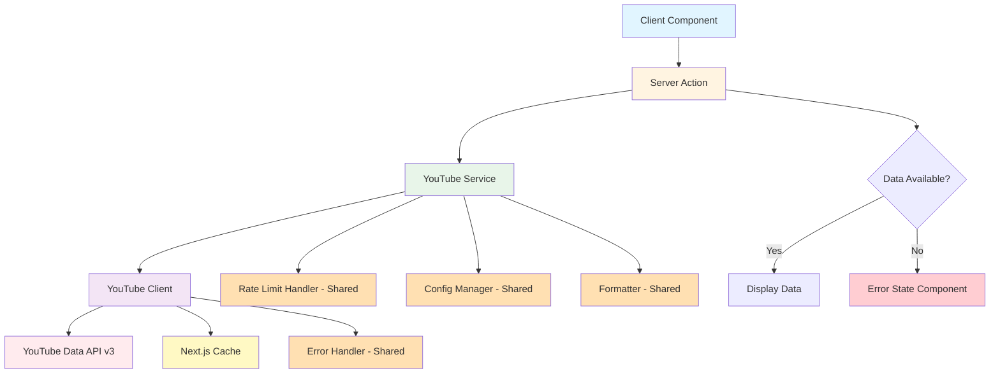
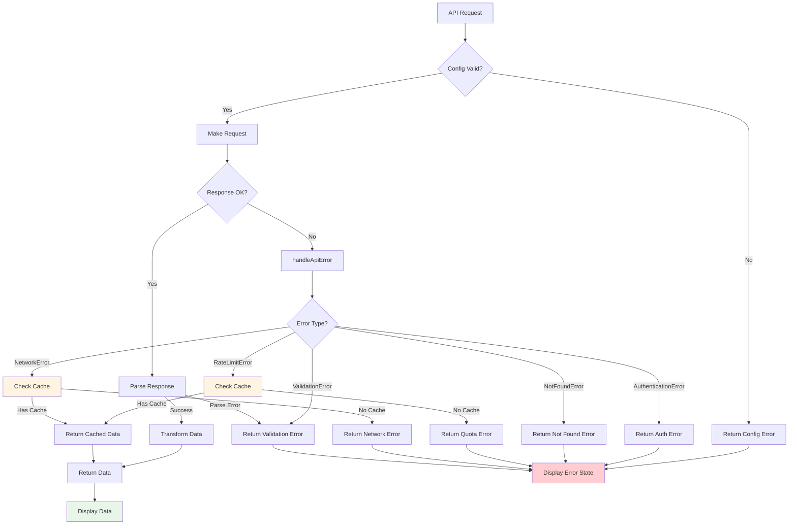

# Design Document: YouTube Metrics Integration

## Overview

This design implements a YouTube Data API v3 integration for fetching and displaying real-time channel statistics and video metrics on a Next.js portfolio website. The architecture leverages shared API utilities from lib/api/ for error handling, formatting, rate limiting, and configuration management, with YouTube-specific code isolated in lib/youtube/.

The integration consists of:
- **Shared Utilities** (lib/api/): Generic error handling, formatting, rate limiting, and configuration utilities
- **YouTube API Client** (lib/youtube/client.ts): Low-level HTTP client for YouTube Data API v3 requests
- **Service Layer** (lib/youtube/service.ts): High-level orchestration with error handling
- **Transformers** (lib/youtube/transformer.ts): Data transformation from API responses to application types
- **YouTube-Specific Types** (lib/youtube/types.ts): YouTube API response and configuration types
- **Error State Component**: UI component for displaying error states when data cannot be loaded
- **Server Actions**: Next.js server actions for client-side data fetching

The system implements a fallback chain: YouTube API (with Next.js cache) → cached data → error state, ensuring the portfolio displays appropriate error messages when data is unavailable.

## Architecture

### System Components



Legend:
- Blue: Client layer
- Yellow: Server action layer
- Green: YouTube service layer
- Purple: YouTube client layer
- Orange: Shared utilities (lib/api/)
- Red: External API
- Light yellow: Cache
- Light red: Error state

### Data Flow

1. **Client Request**: React component calls server action
2. **Service Orchestration**: Service checks rate limits and configuration using shared utilities
3. **API Request**: Client makes authenticated request to YouTube API
4. **Error Handling**: Any errors are classified using shared error handler (handleApiError)
5. **Caching**: Next.js automatically caches response for 1 hour
6. **Transformation**: Raw API data transformed to application types
7. **Formatting**: Numbers formatted using shared formatLargeNumber utility
8. **Fallback**: On error, tries to return cached data
9. **Error State**: If no cached data available, returns error information
10. **Response**: Either formatted data or error state returned to client component
11. **UI Rendering**: Client component displays data or error state component

### Module Structure

The YouTube integration uses shared utilities from lib/api/ and contains only YouTube-specific code in lib/youtube/:

```
lib/api/                # Shared utilities (from shared-api-utilities spec)
├── errors.ts           # Error classes and handleApiError
├── formatters.ts       # formatLargeNumber, formatDate, formatNumber
├── rate-limit.ts       # RateLimitHandler class
├── config.ts           # createConfigReader, validateConfig, isConfigured
├── types.ts            # Shared type definitions
└── index.ts            # Public API exports

lib/youtube/            # YouTube-specific code
├── client.ts           # Low-level API client
├── service.ts          # High-level service orchestration
├── transformer.ts      # API response transformation
├── types.ts            # YouTube-specific type definitions
└── index.ts            # Public API exports

app/actions/
└── youtube.ts          # Server actions for client access
```

## Components and Interfaces

### Shared Utilities (from lib/api/)

The YouTube integration uses the following shared utilities:

**Error Handling**:
```typescript
// Import from lib/api/errors
import {
  ApiError,
  NetworkError,
  AuthenticationError,
  RateLimitError,
  NotFoundError,
  ValidationError,
  handleApiError,
  isRateLimitError,
  isNotFoundError,
  isAuthenticationError
} from '@/lib/api/errors';
```

**Formatting**:
```typescript
// Import from lib/api/formatters
import {
  formatLargeNumber,
  formatDate,
  formatNumber
} from '@/lib/api/formatters';
```

**Rate Limiting**:
```typescript
// Import from lib/api/rate-limit
import { RateLimitHandler } from '@/lib/api/rate-limit';
```

**Configuration**:
```typescript
// Import from lib/api/config
import {
  createConfigReader,
  validateConfig,
  isConfigured
} from '@/lib/api/config';
```

### YouTube API Client

The `YouTubeClient` class handles authenticated HTTP requests to YouTube Data API v3.

**Responsibilities**:
- Construct API URLs with proper query parameters
- Include API key authentication
- Leverage Next.js fetch caching with revalidation
- Parse API responses into typed objects
- Use handleApiError from shared utilities to classify errors
- Throw appropriate error types (NetworkError, AuthenticationError, RateLimitError, NotFoundError)

**Key Methods**:

```typescript
class YouTubeClient {
  constructor(config: YouTubeClientConfig)
  
  // Fetch channel statistics and metadata
  async fetchChannel(channelId: string): Promise<YouTubeApiChannel>
  
  // Fetch recent videos from a channel
  async fetchChannelVideos(channelId: string, maxResults?: number): Promise<YouTubeApiVideo[]>
}
```

**Configuration**:
```typescript
interface YouTubeClientConfig {
  apiKey: string;
  baseUrl?: string;  // Default: 'https://www.googleapis.com/youtube/v3'
  revalidate?: number;  // Default: 3600 seconds (1 hour)
}
```

**Error Handling**:
The client uses `handleApiError` from shared utilities to classify HTTP errors:
- 401/403 with invalid key → AuthenticationError
- 403 with quota exceeded → RateLimitError
- 404 → NotFoundError
- Network failures → NetworkError
- Other errors → ApiError

### YouTube Service

The `YouTubeService` class provides high-level orchestration with fallback handling.

**Responsibilities**:
- Use RateLimitHandler from shared utilities to check quota before requests
- Coordinate client and rate limit handler
- Apply channel ID filters from configuration
- Handle partial failures gracefully using error type guards from shared utilities
- Implement fallback chain to mock data
- Transform API responses to application types
- Format numbers using formatLargeNumber from shared utilities

**Key Methods**:

```typescript
class YouTubeService {
  constructor(
    private client: YouTubeClient,
    private rateLimitHandler: RateLimitHandler,
    private config: YouTubeConfig
  )
  
  // Get channel metrics with fallback
  async getChannelMetrics(): Promise<FetchChannelResult>
  
  // Get recent videos with fallback
  async getRecentVideos(maxResults?: number): Promise<FetchVideosResult>
  
  // Get current quota status
  getQuotaStatus(): QuotaInfo
}
```

**Error Handling**:
The service uses type guard functions from shared utilities:
```typescript
try {
  const data = await this.client.fetchChannel(channelId);
  return { data, source: 'api' };
} catch (error) {
  if (isRateLimitError(error)) {
    // Return cached data or fallback
  } else if (isNotFoundError(error)) {
    // Log warning and continue with other channels
  } else if (isAuthenticationError(error)) {
    // Log error and fall back to mock data
  }
}
```

**Result Types**:
```typescript
interface FetchChannelResult {
  data?: YouTubeChannel[];
  source: 'api' | 'cache' | 'error';
  quotaInfo?: QuotaInfo;
  error?: {
    type: 'quota' | 'auth' | 'not_found' | 'network' | 'config';
    message: string;
  };
}

interface FetchVideosResult {
  data?: Video[];
  source: 'api' | 'cache' | 'error';
  quotaInfo?: QuotaInfo;
  error?: {
    type: 'quota' | 'auth' | 'not_found' | 'network' | 'config';
    message: string;
  };
}
```

### Configuration Module

The YouTube integration uses shared configuration utilities from lib/api/config.

**Setup**:
```typescript
import { createConfigReader, validateConfig, isConfigured } from '@/lib/api/config';

// Create YouTube-specific config reader
const readYouTubeConfig = createConfigReader({
  apiKey: 'YOUTUBE_API_KEY',
  channelIds: 'YOUTUBE_CHANNEL_IDS',
  revalidate: 'YOUTUBE_REVALIDATE'
});

// Get and validate configuration
function getYouTubeConfig(): YouTubeConfig {
  const raw = readYouTubeConfig();
  return validateConfig({
    apiKey: raw.apiKey || '',
    channelIds: raw.channelIds?.split(',').map(id => id.trim()) || [],
    revalidate: parseInt(raw.revalidate || '3600', 10),
    fallbackToMock: true
  });
}
```

**Configuration Type**:
```typescript
interface YouTubeConfig {
  apiKey: string;
  channelIds: string[];  // Support multiple channels
  revalidate: number;
  fallbackToMock: boolean;
}
```

**Environment Variables**:
- `YOUTUBE_API_KEY`: YouTube Data API v3 key
- `YOUTUBE_CHANNEL_IDS`: Comma-separated list of channel IDs
- `YOUTUBE_REVALIDATE`: Cache revalidation time in seconds (default: 3600)

### Rate Limit Handler

The YouTube integration uses the shared `RateLimitHandler` class from lib/api/rate-limit.

**Setup**:
```typescript
import { RateLimitHandler } from '@/lib/api/rate-limit';

// Create handler with YouTube-specific configuration
const rateLimitHandler = new RateLimitHandler({
  headerNames: {
    limit: 'x-ratelimit-limit',
    remaining: 'x-ratelimit-remaining',
    reset: 'x-ratelimit-reset'
  }
});
```

**Usage in Service**:
```typescript
class YouTubeService {
  async getChannelMetrics(): Promise<FetchChannelResult> {
    // Check quota before making request
    const quotaCheck = this.rateLimitHandler.checkLimit();
    
    if (!quotaCheck.canMakeRequest) {
      // Return cached data or fallback
      return this.getCachedOrFallbackData();
    }
    
    try {
      const data = await this.client.fetchChannel(channelId);
      
      // Update rate limit state after successful request
      this.rateLimitHandler.updateFromApi({
        remaining: data.quotaRemaining,
        resetAt: data.quotaResetAt
      });
      
      return { data, source: 'api' };
    } catch (error) {
      if (isRateLimitError(error)) {
        // Update rate limit state from error
        this.rateLimitHandler.updateFromApi({
          remaining: 0,
          resetAt: error.resetAt
        });
      }
      throw error;
    }
  }
}
```

**Quota Information**:
```typescript
interface QuotaInfo {
  canMakeRequest: boolean;
  remaining: number;
  resetAt: Date;
  retryAfter?: number;  // Seconds until reset
}
```

### Error Handling

**Error Types**:
```typescript
class YouTubeError extends Error {
  statusCode?: number;
  quotaInfo?: QuotaInfo;
  isQuotaError: boolean;
  isNotFoundError: boolean;
  isAuthError: boolean;
}
```

**Error Handler Functions**:
```typescript
// Convert unknown errors to YouTubeError
function handleYouTubeError(error: unknown): YouTubeError

// Check if error is quota exceeded
function isQuotaError(error: unknown): boolean

// Check if error is not found (404)
function isNotFoundError(error: unknown): boolean

// Check if error is authentication error
function isAuthError(error: unknown): boolean
```

### Transformers

Transform YouTube API responses to application types.

**Functions**:
```typescript
import { formatLargeNumber } from '@/lib/api/formatters';

// Transform API channel to YouTubeChannel type
function transformChannel(apiChannel: YouTubeApiChannel): YouTubeChannel {
  return {
    id: apiChannel.id,
    name: apiChannel.snippet.title,
    handle: apiChannel.snippet.customUrl,
    subscribers: formatLargeNumber(parseInt(apiChannel.statistics.subscriberCount)),
    url: `https://youtube.com/channel/${apiChannel.id}`,
    viewCount: formatLargeNumber(parseInt(apiChannel.statistics.viewCount)),
    videoCount: formatLargeNumber(parseInt(apiChannel.statistics.videoCount)),
    thumbnailUrl: apiChannel.snippet.thumbnails.high.url
  };
}

// Transform API videos to Video type
function transformVideos(apiVideos: YouTubeApiVideo[]): Video[] {
  return apiVideos.map(video => ({
    id: video.id,
    title: video.snippet.title,
    thumbnail: video.snippet.thumbnails.medium.url,
    url: `https://youtube.com/watch?v=${video.id}`,
    views: parseInt(video.statistics.viewCount),
    channelId: video.snippet.channelId,
    channelTitle: video.snippet.channelTitle
  }));
}

// Transform multiple channels
function transformChannels(apiChannels: YouTubeApiChannel[]): YouTubeChannel[] {
  return apiChannels.map(transformChannel);
}
```

### Server Actions

Next.js server actions provide client-side access to YouTube data.

**Actions**:
```typescript
// Fetch YouTube channel metrics
async function getYouTubeChannels(): Promise<FetchChannelResult>

// Fetch recent videos
async function getYouTubeVideos(maxResults?: number): Promise<FetchVideosResult>

// Get quota status
async function getYouTubeQuotaStatus(): Promise<QuotaInfo>
```

### Error State Component

A React component that displays appropriate error messages when YouTube data cannot be loaded.

**Component Interface**:
```typescript
interface YouTubeErrorStateProps {
  errorType: 'quota' | 'auth' | 'not_found' | 'network' | 'config';
  message: string;
}

function YouTubeErrorState({ errorType, message }: YouTubeErrorStateProps): JSX.Element
```

**Error Messages by Type**:
- `config`: "YouTube integration not configured"
- `quota`: "YouTube API quota limit reached. Please try again later."
- `auth`: "Unable to authenticate with YouTube API"
- `not_found`: "YouTube channel not found"
- `network`: "Unable to load YouTube data. Please try again later."

**Visual Design**:
- Consistent with portfolio design system
- Clear, user-friendly messaging
- Optional icon or illustration
- Appropriate spacing and typography

## Data Models

### YouTube API Response Types

**Channel Response**:
```typescript
interface YouTubeApiChannel {
  kind: 'youtube#channel';
  id: string;
  snippet: {
    title: string;
    description: string;
    customUrl: string;
    thumbnails: {
      default: { url: string };
      medium: { url: string };
      high: { url: string };
    };
  };
  statistics: {
    viewCount: string;
    subscriberCount: string;
    hiddenSubscriberCount: boolean;
    videoCount: string;
  };
}
```

**Video Response**:
```typescript
interface YouTubeApiVideo {
  kind: 'youtube#video';
  id: string;
  snippet: {
    title: string;
    description: string;
    thumbnails: {
      default: { url: string };
      medium: { url: string };
      high: { url: string };
    };
    channelId: string;
    channelTitle: string;
  };
  statistics: {
    viewCount: string;
    likeCount: string;
    commentCount: string;
  };
}
```

**Search Response** (for fetching channel videos):
```typescript
interface YouTubeApiSearchResponse {
  kind: 'youtube#searchListResponse';
  items: Array<{
    kind: 'youtube#searchResult';
    id: {
      kind: 'youtube#video';
      videoId: string;
    };
    snippet: {
      title: string;
      description: string;
      thumbnails: {
        default: { url: string };
        medium: { url: string };
        high: { url: string };
      };
    };
  }>;
}
```

### Application Types

**Extended YouTubeChannel**:
```typescript
interface YouTubeChannel {
  id: string;
  name: string;
  handle: string;
  subscribers: string;  // Formatted string (e.g., "1.2K")
  url: string;
  // Extended fields for metrics
  viewCount?: string;
  videoCount?: string;
  thumbnailUrl?: string;
}
```

**Extended Video**:
```typescript
interface Video {
  id: string;
  title: string;
  thumbnail: string;
  url: string;
  views?: number;
  // Extended fields
  channelId?: string;
  channelTitle?: string;
}
```

### API Endpoints

**Channel Statistics**:
```
GET https://www.googleapis.com/youtube/v3/channels
  ?part=snippet,statistics
  &id={channelId}
  &key={apiKey}
```

**Channel Videos** (two-step process):
1. Search for video IDs:
```
GET https://www.googleapis.com/youtube/v3/search
  ?part=snippet
  &channelId={channelId}
  &order=date
  &type=video
  &maxResults={maxResults}
  &key={apiKey}
```

2. Get video statistics:
```
GET https://www.googleapis.com/youtube/v3/videos
  ?part=snippet,statistics
  &id={videoId1,videoId2,...}
  &key={apiKey}
```

### Quota Costs

YouTube Data API v3 has daily quota limits (default: 10,000 units/day).

**Operation Costs**:
- Channel statistics: 1 unit
- Search (videos): 100 units
- Video statistics: 1 unit per video

**Strategy**: Minimize quota usage by:
- Caching responses for 1 hour
- Fetching only 5 recent videos
- Combining video statistics requests
- Falling back to cached/mock data on quota exceeded


## Correctness Properties

*A property is a characteristic or behavior that should hold true across all valid executions of a system—essentially, a formal statement about what the system should do. Properties serve as the bridge between human-readable specifications and machine-verifiable correctness guarantees.*

### Property Reflection

The following properties focus on data transformation logic that will be tested via property-based tests. API behavior, error handling, and infrastructure concerns are validated through E2E tests instead.

### Property 1: Channel Data Completeness

*For any* valid YouTube API channel response, the transformed YouTubeChannel object SHALL contain all required fields: id, name, handle, subscribers, url, viewCount, videoCount, and thumbnailUrl.

**Validates: Requirements 1.2, 5.1, 5.2, 5.3, 5.4**

**Test Type: Property-Based**

### Property 2: Video Data Completeness

*For any* valid YouTube API video response, the transformed Video object SHALL contain all required fields: id, title, thumbnail, url, views, channelId, and channelTitle.

**Validates: Requirements 6.2, 6.4, 6.5**

**Test Type: Property-Based**

### Property 3: Number Formatting with Suffixes

*For any* positive integer, the formatLargeNumber function from shared utilities SHALL produce a string with appropriate suffix (K for thousands, M for millions, B for billions) and at most one decimal place.

**Validates: Requirements 5.6, 5.7, 5.8**

**Test Type: Property-Based**

### Property 4: Channel ID List Parsing

*For any* comma-separated string of channel IDs, the configuration parser SHALL produce an array of trimmed, non-empty channel ID strings.

**Validates: Requirements 4.6**

**Test Type: Property-Based**

### Property 5: Data Transformation Round-Trip

*For any* valid YouTubeChannel object, serializing it to the API format then parsing and transforming it back SHALL produce an equivalent YouTubeChannel object.

**Validates: Requirements 1.3**

**Test Type: Property-Based**

### E2E Validated Behaviors

The following behaviors are validated through E2E tests rather than property-based tests:

- API key authentication (Requirement 1.6)
- Error handling and classification (Requirements 1.4, 1.5, 7.1-7.7)
- System resilience with error states (Requirements 2.4, 7.6, 7.7)
- Video result limiting (Requirement 6.3)
- Cache behavior and expiration (Requirement 3.1-3.5)
- Rate limiting and quota management (Requirements 2.1-2.6, 13.1-13.7)
- Configuration validation (Requirements 4.1-4.7)
- Error state display (Requirements 14.1-14.8)

## Error Handling

### Error Classification

The system uses error classes from shared utilities (lib/api/errors):

1. **RateLimitError** (HTTP 403 with quota exceeded message)
   - Thrown by handleApiError when quota is exceeded
   - Trigger fallback to cached data
   - Log quota exceeded event
   - Return user-friendly message
   - Set retry-after time based on quota reset

2. **AuthenticationError** (HTTP 401, 403 with invalid key)
   - Thrown by handleApiError for auth failures
   - Log authentication failure
   - Fall back to mock data
   - Return descriptive error message

3. **NotFoundError** (HTTP 404)
   - Thrown by handleApiError for missing resources
   - Log warning for missing channel
   - Fall back to mock data
   - Continue with other channels if multiple configured

4. **NetworkError** (Network failures, timeouts)
   - Thrown by handleApiError for network issues
   - Log error details
   - Fall back to cached or mock data
   - Return generic error message

5. **ValidationError** (Malformed responses)
   - Thrown when API response doesn't match expected schema
   - Log validation failure
   - Fall back to cached or mock data

### Error Handling Flow



### Error Handling in Service

```typescript
import {
  isRateLimitError,
  isNotFoundError,
  isAuthenticationError
} from '@/lib/api/errors';

class YouTubeService {
  async getChannelMetrics(): Promise<FetchChannelResult> {
    // Check configuration
    if (!this.config.apiKey || !this.config.channelIds.length) {
      return {
        source: 'error',
        error: {
          type: 'config',
          message: 'YouTube integration not configured'
        }
      };
    }
    
    try {
      const data = await this.client.fetchChannel(channelId);
      return { data, source: 'api' };
    } catch (error) {
      if (isRateLimitError(error)) {
        // Try to return cached data
        const cached = await this.getCachedData();
        if (cached) {
          return { data: cached, source: 'cache' };
        }
        return {
          source: 'error',
          error: {
            type: 'quota',
            message: 'YouTube API quota limit reached. Please try again later.'
          }
        };
      } else if (isNotFoundError(error)) {
        return {
          source: 'error',
          error: {
            type: 'not_found',
            message: 'YouTube channel not found'
          }
        };
      } else if (isAuthenticationError(error)) {
        return {
          source: 'error',
          error: {
            type: 'auth',
            message: 'Unable to authenticate with YouTube API'
          }
        };
      }
      
      // Network or other errors - try cache first
      const cached = await this.getCachedData();
      if (cached) {
        return { data: cached, source: 'cache' };
      }
      
      return {
        source: 'error',
        error: {
          type: 'network',
          message: 'Unable to load YouTube data. Please try again later.'
        }
      };
    }
  }
}
```

### Error Messages

**User-Facing Messages** (displayed in Error State Component):
- Configuration missing: "YouTube integration not configured"
- Quota exceeded: "YouTube API quota limit reached. Please try again later."
- Authentication failed: "Unable to authenticate with YouTube API"
- Channel not found: "YouTube channel not found"
- Network error: "Unable to load YouTube data. Please try again later."

**Logging**:
- All errors logged with full context (error type, channel ID, timestamp)
- Quota exceeded events logged for monitoring
- Authentication failures logged as errors
- Not found errors logged as warnings
- Network errors logged with retry information
- Configuration errors logged as warnings

### Fallback Chain

1. **Primary**: YouTube API with Next.js cache (1 hour)
2. **Secondary**: Cached data from previous successful request
3. **Tertiary**: Error state component with appropriate message

The system never throws unhandled exceptions to the UI layer. All errors are caught, logged, and handled with either cached data or an error state component using the shared error handling utilities.

## Testing Strategy

### Dependencies

The YouTube integration depends on shared API utilities from lib/api/. The testing strategy focuses on:
- E2E tests for API integration and infrastructure
- Unit tests for React components to validate different data states
- Property-based tests for data transformation logic

### Testing Approach

**E2E Tests** (Primary focus for API and infrastructure):
- Full integration flow: API request → caching → data display
- Error scenarios: quota exceeded, authentication failure, network errors
- Configuration scenarios: missing config, invalid config
- Cache behavior: cache hits, cache misses, cache expiration
- Rate limiting: quota tracking, quota exceeded handling
- Multiple channel IDs handling
- Server actions integration

**Component Unit Tests** (Focus on UI rendering):
- YouTube data display component with valid data
- YouTube data display component with loading state
- Error state component with different error types (quota, auth, not_found, network, config)
- Number formatting display (using formatLargeNumber)
- Video list rendering with different video counts
- Empty state handling

**Property-Based Tests** (Data transformation only):
1. Channel data completeness (Property 1)
2. Video data completeness (Property 2)
3. Number formatting with suffixes (Property 7)
4. Channel ID list parsing (Property 6)
5. Data transformation round-trip (Property 12)

**No Unit Tests For**:
- API client (tested via E2E)
- Service layer (tested via E2E)
- Error handling (tested via E2E)
- Rate limiting (tested via E2E)
- Configuration management (tested via E2E)
- Shared utilities integration (tested via E2E)

### Property-Based Testing Configuration

**Library**: Use `fast-check` for TypeScript/JavaScript property-based testing

**Configuration**:
- Minimum 100 iterations per property test
- Each test tagged with reference to design property
- Tag format: `Feature: youtube-metrics-integration, Property {number}: {property_text}`

**Example Test Structure**:
```typescript
import fc from 'fast-check';

// Feature: youtube-metrics-integration, Property 1: Channel Data Completeness
test('transformed channel contains all required fields', () => {
  fc.assert(
    fc.property(
      youtubeApiChannelArbitrary(),
      (apiChannel) => {
        const transformed = transformChannel(apiChannel);
        
        expect(transformed).toHaveProperty('id');
        expect(transformed).toHaveProperty('name');
        expect(transformed).toHaveProperty('handle');
        expect(transformed).toHaveProperty('subscribers');
        expect(transformed).toHaveProperty('url');
        expect(transformed).toHaveProperty('viewCount');
        expect(transformed).toHaveProperty('videoCount');
        expect(transformed).toHaveProperty('thumbnailUrl');
      }
    ),
    { numRuns: 100 }
  );
});
```

### Test Coverage Requirements

**E2E Tests** (API and Infrastructure):
- Successful channel data fetch and display
- Successful video data fetch and display
- Quota exceeded with cache available → displays cached data
- Quota exceeded without cache → displays error state
- Authentication error → displays error state
- Channel not found → displays error state
- Network error with cache → displays cached data
- Network error without cache → displays error state
- Missing configuration → displays error state
- Invalid configuration → displays error state
- Cache expiration and revalidation
- Rate limit tracking and quota management
- Multiple channel IDs processing
- Server actions return correct structure

**Component Unit Tests**:
- YouTube channel display with valid data
- YouTube video list with valid data
- Error state component with quota error
- Error state component with auth error
- Error state component with not_found error
- Error state component with network error
- Error state component with config error
- Loading state display
- Number formatting in UI (subscribers, views, video counts)
- Empty video list handling

**Property-Based Tests** (Data Transformation):
1. Channel data completeness (Property 1) - transformChannel includes all required fields
2. Video data completeness (Property 2) - transformVideos includes all required fields
3. Number formatting with suffixes (Property 7) - formatLargeNumber produces correct K/M/B suffixes
4. Channel ID list parsing (Property 6) - comma-separated string parsing
5. Data transformation round-trip (Property 12) - parse → format → parse equivalence

### Test Data Generators

For property-based tests, create generators (arbitraries) for:
- Valid YouTube API channel responses
- Valid YouTube API video responses
- Numbers across full range (0 to billions)
- Channel ID lists (comma-separated strings)

### E2E Testing Setup

**Test Environment**:
- Use Playwright or Cypress for E2E tests
- Mock YouTube API responses at the network level
- Test against real Next.js cache behavior
- Verify actual UI rendering and error states

**Mock Scenarios**:
- Successful API responses
- Quota exceeded responses (403 with quota error)
- Authentication errors (401/403 with auth error)
- Not found errors (404)
- Network timeouts and failures
- Malformed JSON responses
- Missing/invalid configuration

### Mocking Strategy

**E2E Tests** (Network-level mocking):
- Mock YouTube API endpoints at HTTP level
- Simulate different response scenarios
- Test real cache behavior
- Verify actual error state rendering

**Component Tests** (Props-based testing):
- Pass different data props to components
- Pass different error props to error state component
- No need to mock API or services
- Focus on UI rendering logic

**Property-Based Tests** (Generator-based):
- Generate random valid API responses
- Generate random numbers for formatting
- Generate random channel ID lists
- No mocking needed - pure function testing

### Performance Testing

E2E tests should monitor:
- API response times
- Cache hit rates
- Page load times with YouTube data
- Error state rendering performance

Target metrics:
- API response time: < 500ms (p95)
- Cache hit rate: > 95%
- Page load with cached data: < 100ms
- Error state display: < 50ms

