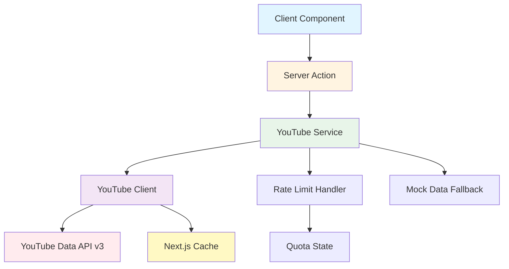
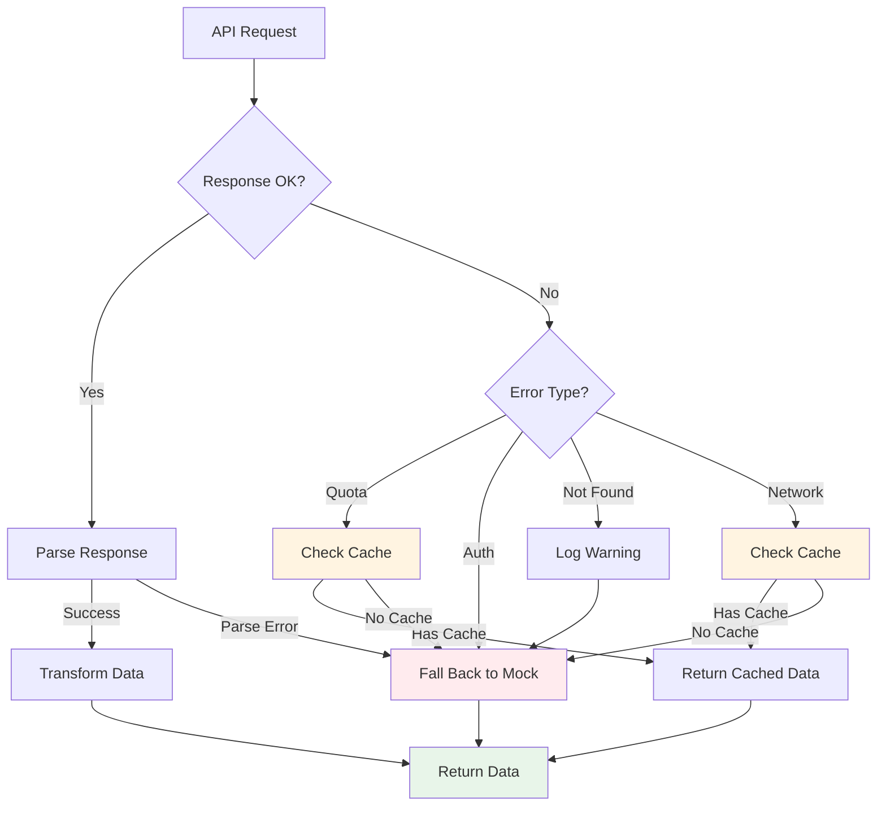

# Design Document: YouTube Metrics Integration

## Overview

This design implements a YouTube Data API v3 integration for fetching and displaying real-time channel statistics and video metrics on a Next.js portfolio website. The architecture follows the established GitHub integration pattern, providing a modular, type-safe, and cache-optimized solution.

The integration consists of:
- **YouTube API Client**: Low-level HTTP client for YouTube Data API v3 requests
- **Service Layer**: High-level orchestration with fallback handling
- **Configuration Module**: Environment-based configuration management
- **Error Handling**: Comprehensive error handling with quota limit detection
- **Rate Limit Handler**: Quota monitoring and cache fallback logic
- **Transformers**: Data transformation from API responses to application types
- **Server Actions**: Next.js server actions for client-side data fetching

The system implements a fallback chain: YouTube API (with Next.js cache) → mock data, ensuring the portfolio remains functional even when API quotas are exceeded or configuration is missing.

## Architecture

### System Components



### Data Flow

1. **Client Request**: React component calls server action
2. **Service Orchestration**: Service checks rate limits and configuration
3. **API Request**: Client makes authenticated request to YouTube API
4. **Caching**: Next.js automatically caches response for 1 hour
5. **Transformation**: Raw API data transformed to application types
6. **Fallback**: On error or quota exceeded, returns mock data
7. **Response**: Formatted data returned to client component

### Module Structure

Following the GitHub integration pattern:

```
lib/youtube/
├── client.ts          # Low-level API client
├── config.ts          # Configuration management
├── errors.ts          # Error handling utilities
├── formatters.ts      # Number formatting utilities
├── index.ts           # Public API exports
├── rate-limit.ts      # Quota tracking and handling
├── service.ts         # High-level service orchestration
├── transformer.ts     # API response transformation
└── types.ts           # TypeScript type definitions

app/actions/
└── youtube.ts         # Server actions for client access
```

## Components and Interfaces

### YouTube API Client

The `YouTubeClient` class handles authenticated HTTP requests to YouTube Data API v3.

**Responsibilities**:
- Construct API URLs with proper query parameters
- Include API key authentication
- Leverage Next.js fetch caching with revalidation
- Parse API responses into typed objects
- Extract quota information from response headers
- Handle HTTP errors and convert to typed errors

**Key Methods**:

```typescript
class YouTubeClient {
  constructor(config: YouTubeClientConfig)
  
  // Fetch channel statistics and metadata
  async fetchChannel(channelId: string): Promise<YouTubeApiChannel>
  
  // Fetch recent videos from a channel
  async fetchChannelVideos(channelId: string, maxResults?: number): Promise<YouTubeApiVideo[]>
  
  // Get current quota usage (if available)
  async getQuotaInfo(): Promise<YouTubeQuotaInfo | undefined>
}
```

**Configuration**:
```typescript
interface YouTubeClientConfig {
  apiKey: string;
  baseUrl?: string;  // Default: 'https://www.googleapis.com/youtube/v3'
  revalidate?: number;  // Default: 3600 seconds (1 hour)
}
```

### YouTube Service

The `YouTubeService` class provides high-level orchestration with fallback handling.

**Responsibilities**:
- Check quota limits before making requests
- Coordinate client and rate limit handler
- Apply channel ID filters from configuration
- Handle partial failures gracefully
- Implement fallback chain to mock data
- Transform API responses to application types

**Key Methods**:

```typescript
class YouTubeService {
  constructor(config: YouTubeServiceConfig)
  
  // Get channel metrics with fallback
  async getChannelMetrics(): Promise<FetchChannelResult>
  
  // Get recent videos with fallback
  async getRecentVideos(maxResults?: number): Promise<FetchVideosResult>
  
  // Get current quota status
  getQuotaStatus(): QuotaInfo
}
```

**Result Types**:
```typescript
interface FetchChannelResult {
  data: YouTubeChannel[];
  source: 'api' | 'cache' | 'fallback';
  quotaInfo?: QuotaInfo;
  error?: string;
}

interface FetchVideosResult {
  data: Video[];
  source: 'api' | 'cache' | 'fallback';
  quotaInfo?: QuotaInfo;
  error?: string;
}
```

### Configuration Module

**Functions**:
```typescript
// Read configuration from environment variables
function getYouTubeConfig(): YouTubeConfig

// Validate and normalize configuration
function validateConfig(config: Partial<YouTubeConfig>): YouTubeConfig

// Check if YouTube integration is configured
function isConfigured(config: YouTubeConfig): boolean
```

**Configuration Type**:
```typescript
interface YouTubeConfig {
  apiKey: string;
  channelIds: string[];  // Support multiple channels
  revalidate: number;
  fallbackToMock: boolean;
}
```

**Environment Variables**:
- `YOUTUBE_API_KEY`: YouTube Data API v3 key
- `YOUTUBE_CHANNEL_IDS`: Comma-separated list of channel IDs
- `YOUTUBE_REVALIDATE`: Cache revalidation time in seconds (default: 3600)

### Rate Limit Handler

The `RateLimitHandler` class tracks YouTube API quota usage.

**Responsibilities**:
- Track quota consumption across requests
- Determine if requests can be made
- Calculate time until quota reset
- Update quota state from API responses
- Provide quota information for monitoring

**Key Methods**:

```typescript
class RateLimitHandler {
  // Check if a request can be made
  checkQuota(): QuotaInfo
  
  // Update quota state from API response
  updateFromApi(quotaInfo: YouTubeQuotaInfo): void
  
  // Record quota consumption
  recordUsage(cost: number): void
}
```

**Quota Information**:
```typescript
interface QuotaInfo {
  canMakeRequest: boolean;
  remaining: number;
  resetAt: Date;
  retryAfter?: number;  // Seconds until reset
}
```

### Error Handling

**Error Types**:
```typescript
class YouTubeError extends Error {
  statusCode?: number;
  quotaInfo?: QuotaInfo;
  isQuotaError: boolean;
  isNotFoundError: boolean;
  isAuthError: boolean;
}
```

**Error Handler Functions**:
```typescript
// Convert unknown errors to YouTubeError
function handleYouTubeError(error: unknown): YouTubeError

// Check if error is quota exceeded
function isQuotaError(error: unknown): boolean

// Check if error is not found (404)
function isNotFoundError(error: unknown): boolean

// Check if error is authentication error
function isAuthError(error: unknown): boolean
```

### Transformers

Transform YouTube API responses to application types.

**Functions**:
```typescript
// Transform API channel to YouTubeChannel type
function transformChannel(apiChannel: YouTubeApiChannel): YouTubeChannel

// Transform API videos to Video type
function transformVideos(apiVideos: YouTubeApiVideo[]): Video[]

// Transform multiple channels
function transformChannels(apiChannels: YouTubeApiChannel[]): YouTubeChannel[]
```

### Formatters

Format numbers for display with locale support.

**Functions**:
```typescript
// Format large numbers with K/M/B suffixes
function formatNumber(num: number, locale?: string): string

// Format subscriber count
function formatSubscribers(count: number, locale?: string): string

// Format view count
function formatViews(count: number, locale?: string): string
```

**Examples**:
- `1234` → `"1.2K"`
- `1234567` → `"1.2M"`
- `1234567890` → `"1.2B"`

### Server Actions

Next.js server actions provide client-side access to YouTube data.

**Actions**:
```typescript
// Fetch YouTube channel metrics
async function getYouTubeChannels(): Promise<FetchChannelResult>

// Fetch recent videos
async function getYouTubeVideos(maxResults?: number): Promise<FetchVideosResult>

// Get quota status
async function getYouTubeQuotaStatus(): Promise<QuotaInfo>
```

## Data Models

### YouTube API Response Types

**Channel Response**:
```typescript
interface YouTubeApiChannel {
  kind: 'youtube#channel';
  id: string;
  snippet: {
    title: string;
    description: string;
    customUrl: string;
    thumbnails: {
      default: { url: string };
      medium: { url: string };
      high: { url: string };
    };
  };
  statistics: {
    viewCount: string;
    subscriberCount: string;
    hiddenSubscriberCount: boolean;
    videoCount: string;
  };
}
```

**Video Response**:
```typescript
interface YouTubeApiVideo {
  kind: 'youtube#video';
  id: string;
  snippet: {
    title: string;
    description: string;
    thumbnails: {
      default: { url: string };
      medium: { url: string };
      high: { url: string };
    };
    channelId: string;
    channelTitle: string;
  };
  statistics: {
    viewCount: string;
    likeCount: string;
    commentCount: string;
  };
}
```

**Search Response** (for fetching channel videos):
```typescript
interface YouTubeApiSearchResponse {
  kind: 'youtube#searchListResponse';
  items: Array<{
    kind: 'youtube#searchResult';
    id: {
      kind: 'youtube#video';
      videoId: string;
    };
    snippet: {
      title: string;
      description: string;
      thumbnails: {
        default: { url: string };
        medium: { url: string };
        high: { url: string };
      };
    };
  }>;
}
```

### Application Types

**Extended YouTubeChannel**:
```typescript
interface YouTubeChannel {
  id: string;
  name: string;
  handle: string;
  subscribers: string;  // Formatted string (e.g., "1.2K")
  url: string;
  // Extended fields for metrics
  viewCount?: string;
  videoCount?: string;
  thumbnailUrl?: string;
}
```

**Extended Video**:
```typescript
interface Video {
  id: string;
  title: string;
  thumbnail: string;
  url: string;
  views?: number;
  // Extended fields
  channelId?: string;
  channelTitle?: string;
}
```

### API Endpoints

**Channel Statistics**:
```
GET https://www.googleapis.com/youtube/v3/channels
  ?part=snippet,statistics
  &id={channelId}
  &key={apiKey}
```

**Channel Videos** (two-step process):
1. Search for video IDs:
```
GET https://www.googleapis.com/youtube/v3/search
  ?part=snippet
  &channelId={channelId}
  &order=date
  &type=video
  &maxResults={maxResults}
  &key={apiKey}
```

2. Get video statistics:
```
GET https://www.googleapis.com/youtube/v3/videos
  ?part=snippet,statistics
  &id={videoId1,videoId2,...}
  &key={apiKey}
```

### Quota Costs

YouTube Data API v3 has daily quota limits (default: 10,000 units/day).

**Operation Costs**:
- Channel statistics: 1 unit
- Search (videos): 100 units
- Video statistics: 1 unit per video

**Strategy**: Minimize quota usage by:
- Caching responses for 1 hour
- Fetching only 5 recent videos
- Combining video statistics requests
- Falling back to cached/mock data on quota exceeded


## Correctness Properties

*A property is a characteristic or behavior that should hold true across all valid executions of a system—essentially, a formal statement about what the system should do. Properties serve as the bridge between human-readable specifications and machine-verifiable correctness guarantees.*

### Property Reflection

After analyzing all acceptance criteria, I identified the following redundancies:
- Properties 5.1-5.4 (showing subscriber, view, video counts, name, and handle) can be combined into a single property about complete channel data transformation
- Properties 6.2 and 6.4 (video fields and view count) can be combined into a single property about complete video data transformation
- Properties 8.4 and 8.5 (locale formatting) are redundant - one comprehensive property covers both
- Properties 10.2 and 10.3 (extracting subscriber, view, and video counts) can be combined with property 1.2 into a single property about field extraction

### Property 1: Channel Data Completeness

*For any* valid YouTube API channel response, the transformed YouTubeChannel object SHALL contain all required fields: id, name, handle, subscribers, url, viewCount, videoCount, and thumbnailUrl.

**Validates: Requirements 1.2, 5.1, 5.2, 5.3, 5.4, 10.2, 10.3**

### Property 2: Video Data Completeness

*For any* valid YouTube API video response, the transformed Video object SHALL contain all required fields: id, title, thumbnail, url, views, channelId, and channelTitle.

**Validates: Requirements 6.2, 6.4, 6.5**

### Property 3: API Key Authentication

*For any* API request made by the YouTube client, the request SHALL include the API key in the query parameters.

**Validates: Requirements 1.5**

### Property 4: Error Handling Produces Descriptive Messages

*For any* YouTube API error response, the error handler SHALL produce a YouTubeError object with a descriptive message and appropriate error classification (quota, not found, or auth error).

**Validates: Requirements 1.4, 10.4**

### Property 5: System Resilience with Fallback Data

*For any* API failure (quota exceeded, network error, or invalid response), the service SHALL return fallback data and continue functioning without throwing unhandled exceptions.

**Validates: Requirements 2.4, 7.3, 7.5**

### Property 6: Channel ID List Parsing

*For any* comma-separated string of channel IDs, the configuration parser SHALL produce an array of trimmed, non-empty channel ID strings.

**Validates: Requirements 4.5**

### Property 7: Number Formatting with Suffixes

*For any* positive integer, the formatter SHALL produce a string with appropriate suffix (K for thousands, M for millions, B for billions) and at most one decimal place.

**Validates: Requirements 5.5**

### Property 8: Video Result Limiting

*For any* channel with N videos where N > 5, fetching recent videos SHALL return exactly 5 videos ordered by date (most recent first).

**Validates: Requirements 6.3**

### Property 9: Locale-Aware Number Formatting

*For any* number and valid locale string, the formatter SHALL produce locale-appropriate number formatting (e.g., "1,234" for en-US, "1.234" for pt-BR).

**Validates: Requirements 8.4, 8.5**

### Property 10: API Response Type Validation

*For any* API response, if the response does not match the expected YouTube API schema, the validator SHALL reject it and return a descriptive error.

**Validates: Requirements 9.4**

### Property 11: JSON Parsing Correctness

*For any* valid YouTube API JSON response, parsing the response SHALL produce a typed object that can be successfully transformed to application types.

**Validates: Requirements 10.1**

### Property 12: Data Transformation Round-Trip

*For any* valid YouTubeChannel object, serializing it to the API format then parsing and transforming it back SHALL produce an equivalent YouTubeChannel object.

**Validates: Requirements 1.3, 10.5**

## Error Handling

### Error Classification

The system classifies errors into four categories:

1. **Quota Errors** (HTTP 403 with quota exceeded message)
   - Trigger fallback to cached data
   - Log quota exceeded event
   - Return user-friendly message
   - Set retry-after time based on quota reset

2. **Authentication Errors** (HTTP 401, 403 with invalid key)
   - Log authentication failure
   - Fall back to mock data
   - Return descriptive error message

3. **Not Found Errors** (HTTP 404)
   - Log warning for missing channel
   - Fall back to mock data
   - Continue with other channels if multiple configured

4. **Network/Parse Errors**
   - Log error details
   - Fall back to cached or mock data
   - Return generic error message

### Error Handling Flow



### Error Messages

**User-Facing Messages**:
- Quota exceeded: "YouTube API quota limit reached. Displaying cached data."
- Authentication failed: "YouTube API authentication failed. Please check your API key."
- Channel not found: "YouTube channel not found. Displaying sample data."
- Network error: "Unable to fetch YouTube data. Displaying cached data."
- Complete failure: "YouTube data temporarily unavailable. Please try again later."

**Logging**:
- All errors logged with full context (error type, channel ID, timestamp)
- Quota exceeded events logged for monitoring
- Authentication failures logged as errors
- Not found errors logged as warnings
- Network errors logged with retry information

### Fallback Chain

1. **Primary**: YouTube API with Next.js cache (1 hour)
2. **Secondary**: Cached data from previous successful request
3. **Tertiary**: Mock data from `lib/data/mockData.ts`

The system never throws unhandled exceptions to the UI layer. All errors are caught, logged, and handled with appropriate fallback data.

## Testing Strategy

### Dual Testing Approach

This feature requires both unit tests and property-based tests to ensure comprehensive coverage:

**Unit Tests** focus on:
- Specific examples of correct behavior (e.g., fetching a known channel)
- Edge cases (quota exceeded with no cache, missing configuration)
- Integration points between components
- Error handling for specific error types
- Mock data fallback scenarios

**Property-Based Tests** focus on:
- Universal properties that hold for all inputs
- Data transformation correctness across random inputs
- Number formatting across wide range of values
- Configuration parsing for various input formats
- Error handling across random error responses

Together, these approaches provide comprehensive coverage: unit tests catch concrete bugs in specific scenarios, while property tests verify general correctness across the input space.

### Property-Based Testing Configuration

**Library**: Use `fast-check` for TypeScript/JavaScript property-based testing

**Configuration**:
- Minimum 100 iterations per property test
- Each test tagged with reference to design property
- Tag format: `Feature: youtube-metrics-integration, Property {number}: {property_text}`

**Example Test Structure**:
```typescript
import fc from 'fast-check';

// Feature: youtube-metrics-integration, Property 1: Channel Data Completeness
test('transformed channel contains all required fields', () => {
  fc.assert(
    fc.property(
      youtubeApiChannelArbitrary(),
      (apiChannel) => {
        const transformed = transformChannel(apiChannel);
        
        expect(transformed).toHaveProperty('id');
        expect(transformed).toHaveProperty('name');
        expect(transformed).toHaveProperty('handle');
        expect(transformed).toHaveProperty('subscribers');
        expect(transformed).toHaveProperty('url');
        expect(transformed).toHaveProperty('viewCount');
        expect(transformed).toHaveProperty('videoCount');
        expect(transformed).toHaveProperty('thumbnailUrl');
      }
    ),
    { numRuns: 100 }
  );
});
```

### Test Coverage Requirements

**Unit Tests**:
- Configuration loading from environment variables
- Error classification (quota, auth, not found, network)
- Fallback chain execution
- Mock data return when configuration missing
- Specific API response parsing examples
- Cache behavior with Next.js fetch

**Property-Based Tests** (one test per property):
1. Channel data completeness (Property 1)
2. Video data completeness (Property 2)
3. API key authentication (Property 3)
4. Error handling produces descriptive messages (Property 4)
5. System resilience with fallback data (Property 5)
6. Channel ID list parsing (Property 6)
7. Number formatting with suffixes (Property 7)
8. Video result limiting (Property 8)
9. Locale-aware number formatting (Property 9)
10. API response type validation (Property 10)
11. JSON parsing correctness (Property 11)
12. Data transformation round-trip (Property 12)

**Integration Tests**:
- Server actions return correct data structure
- Client components render channel data
- Error states display user-friendly messages
- Quota exceeded triggers fallback
- Multiple channel IDs handled correctly

### Test Data Generators

For property-based tests, create generators (arbitraries) for:
- Valid YouTube API channel responses
- Valid YouTube API video responses
- Various error responses (quota, auth, not found)
- Channel ID lists (comma-separated strings)
- Numbers across full range (0 to billions)
- Locale strings (en-US, pt-BR, etc.)

### Mocking Strategy

**Mock YouTube API responses** for:
- Successful channel fetch
- Successful video fetch
- Quota exceeded error
- Authentication error
- Not found error
- Malformed JSON response

**Mock Next.js cache** for:
- Cache hit scenarios
- Cache miss scenarios
- Cache expiration scenarios

### Performance Testing

While not part of automated tests, monitor:
- API response times
- Cache hit rates
- Quota consumption rates
- Fallback frequency

Target metrics:
- API response time: < 500ms (p95)
- Cache hit rate: > 95%
- Quota consumption: < 1000 units/day
- Fallback rate: < 1%

